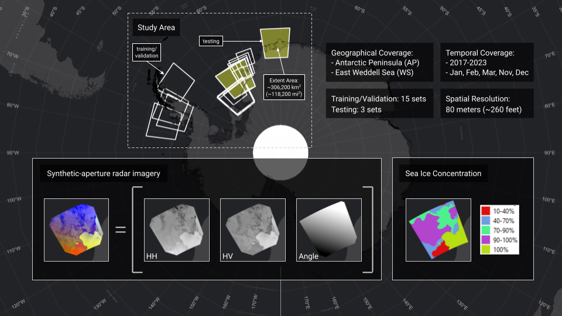

<br></br>


<br><br>

[](https://opensource.org/licenses/MIT)

# AI4ER Guided Team Challenge 2023: Sea Ice Classification

This repository contains code for the Sea Ice Classification Challenge from the 2022-23 cohort of [AI4ER](https://ai4er-cdt.esc.cam.ac.uk). 
<br><br>
AI4ER is the the UKRI Centre for Doctoral Training (CDT) in the Application of Artificial Intelligence to the study of Environmental Risks at the [University of Cambridge](https://www.cam.ac.uk).

## Project Description

This goal of this 3-month project was to automatically classify sea ice concentration in the East Weddell Sea, Antarctica. The Weddell Sea is an active area of iceberg calving [[1]](https://www.bas.ac.uk/media-post/brunt-ice-shelf-in-antarctica-calves-giant-iceberg/) and a critical shipping route for access to the Halley Research Station, a research facility operated by the British Antarctic Survey. Accurate assessments of sea ice concenration in the East Weddell Sea are hence of great importance to ensure the safety and success of future expeditions.


## Demonstration

### TO DO: Include images of reference vs predicted charts


## Data
This project uses two publicly available datasets:
- Labeled sea ice charts jointly developed by the [Arctic and Antarctic Research Institute, USA National/Naval Ice Center, and Norwegian Meteorological Institute](http://ice.aari.aq/antice/).
- Sentinel 1 Synthetic Aperture Radar (SAR) satellite imagery provided by the [Copernicus Open Access Hub](https://sentinels.copernicus.eu/web/sentinel/missions/sentinel-1/data-products), operated by the European Space Agency. The Copernicus Open Data Policy enables free, open access to Sentinel products [[2](https://sentinel.esa.int/web/sentinel/faq)]. Sentinel Terms and Conditions can be found at the following [link](https://sentinel.esa.int/documents/247904/690755/Sentinel_Data_Legal_Notice).

These datasets are shown below superimposed over the region of interest on Google Earth.

### TO DO - Joshua - Include data images




## Models
This project uses three models:
1. A baseline Decision Tree (DT) model
2. A basic U-Net
3. A pretrained resnet34 from the [segmentation_models_pytorch](https://segmentation-modelspytorch.readthedocs.io/en/latest/) Python library, which is distributed under the MIT license. [](https://opensource.org/licenses/MIT)


## Code Structure

```
├───Data                            <-- containing the satellite images and ice chart data used for this project
│   ├───dual_band_images
│   ├───rasterised_ice_charts
├───Notebooks                       <-- exploratory data analysis notebooks
│   ├───EDA_SIC.ipynb
|──────info.md
|──────JASMIN.md                    <-- Step-by-step guide
|──────constants.py                 <-- SAR/ice chart pairs, binary/ternary classes
|──────environment.yml              <-- List of Python modules
|──────interesting_images.csv       <-- List of tiles containing all three categories for ternary classification
|──────interesting_images.py        <-- Generate interesting_images.csv
|──────metrics.csv                  <-- Lists mean and std dev of all SAR images
|──────metrics.py                   <-- Calculate metrics.csv
|──────metrics_per_pair.csv         <-- Lists mean and std dev for individual SAR image
│──────model.py                     <-- Unet model and evaluation metrics
│──────split.py                     <-- Construct training & validation datasets
│──────test.py                      <-- Test CNN and save output to WANDB
|──────test_scikit.py               <-- Test DT and save output to WANDB
|──────test_slurm_script.py         <-- Test the model on JASMIN
|──────test_slurm_script_scikit.py  <-- Test the DT on JASMIN
|──────tiling.py                    <-- Generate tiles from SAR/ice chart paris
│──────train.py                     <-- Train CNN and save output to WANDB
|──────train_scikit.py              <-- Train DT and save output to WANDB
|──────train_slurm_script.sh        <-- Train the model on JASMIN
|──────train_slurm_script_scikit.sh <-- Train the DT on JASMIN
│──────util.py                      <-- Load data into the model and normalise
|──────util_scikit.py               <-- Load data into the model, normalise and create the training dataset
```

## Workflow

### CNN Workflow
Workflow for U-Net and resnet34


### Decision Tree Workflow


## Usage
An archived copy of this repository at the time of project submission (17th March 2023) is available on Zenodo **(TBC)**. To test the code and recreate the results of this project, follow the steps below: 
1. Clone this repository (for the latest version) or retrieve the archived copy from Zenodo
2. Create and activate the conda environment using ```conda activate environment.yml```, which contains all required Python modules and versions.
3. To generate ice chart and SAR tile pairs of 256x256 dimensions run: ```python tiling.py```. Tile pairs containing NaN values will be discarded.
4. Follow the steps in [JASMIN.md](https://github.com/ai4er-cdt/sea-ice-classification/blob/dev/JASMIN.md) to train and test the CNN or DT model. Input arguments that were modified for this project include:

    | Argument                   | Options          | Default|
    | -------------------------- |:----------------:| ------:|
    | --model                    | unet, resnet34   | unet   |
    | --classification_type      | binary, ternary  | binary |
    | --sar_band3                | angle, ratio     | angle  |
  

## Contributors
Project core members contributed equally to this work:
- [Joshua Dimasaka](https://ai4er-cdt.esc.cam.ac.uk/StaffDirectory/students-all/2022-students), AI4ER MRes Student (2022 Cohort), University of Cambridge
- [Andrew McDonald](https://ai4er-cdt.esc.cam.ac.uk/StaffDirectory/students-all/2022-students), AI4ER MRes Student (2022 Cohort), Univeristy of Cambridge
- [Meghan Plumridge](https://ai4er-cdt.esc.cam.ac.uk/StaffDirectory/students-all/2022-students), AI4ER MRes Student (2022 Cohort), University of Cambridge
- [Jay Torry](https://ai4er-cdt.esc.cam.ac.uk/StaffDirectory/students-all/2022-students), AI4ER MRes Student (2022 Cohort), University of Cambridge
- [Andrés Camilo Zúñiga González](https://ai4er-cdt.esc.cam.ac.uk/StaffDirectory/students-all/2022-students), AI4ER MRes Student (2022 Cohort), University of Cambridge

With special thanks to our advisors for their project guidance and technical support:
- Madeline Lisaius, AI4ER PhD Student (2021 Cohort), University of Cambridge
- Jonathan Roberts, AI4ER PhD Student (2021 Cohort), University of Cambridge
- Martin Rogers, AI-lab, British Antarctic Survey

## References
[1] Brunt ice shelf in Antarctica calves giant iceberg (2023) British Antarctic Survey. Available at: https://www.bas.ac.uk/media-post/brunt-ice-shelf-in-antarctica-calves-giant-iceberg/ (Accessed: March 9, 2023). 

[2] The European Space Agency (n.d.) FAQ content, FAQ - Sentinel Online - Sentinel Online. Available at: https://sentinel.esa.int/web/sentinel/faq (Accessed: March 17, 2023). 
